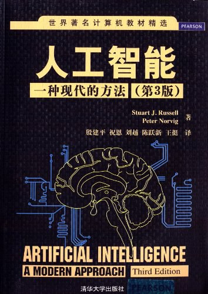
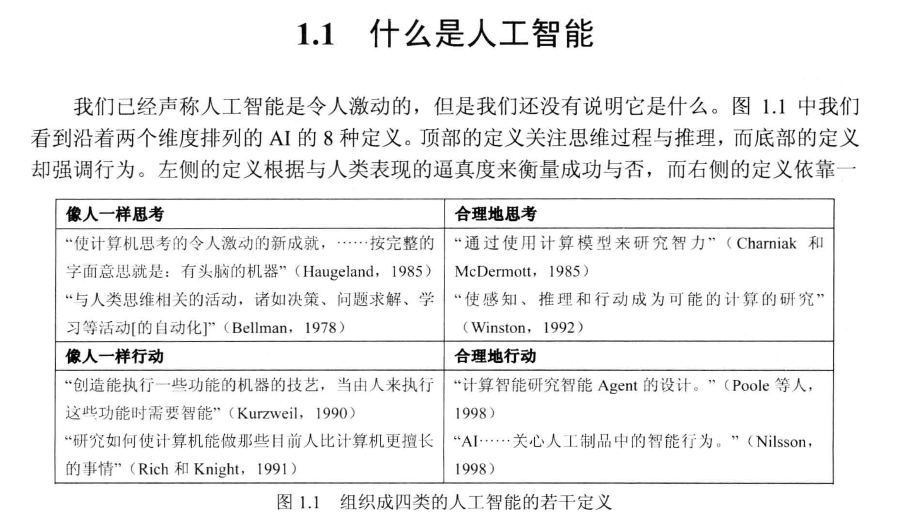
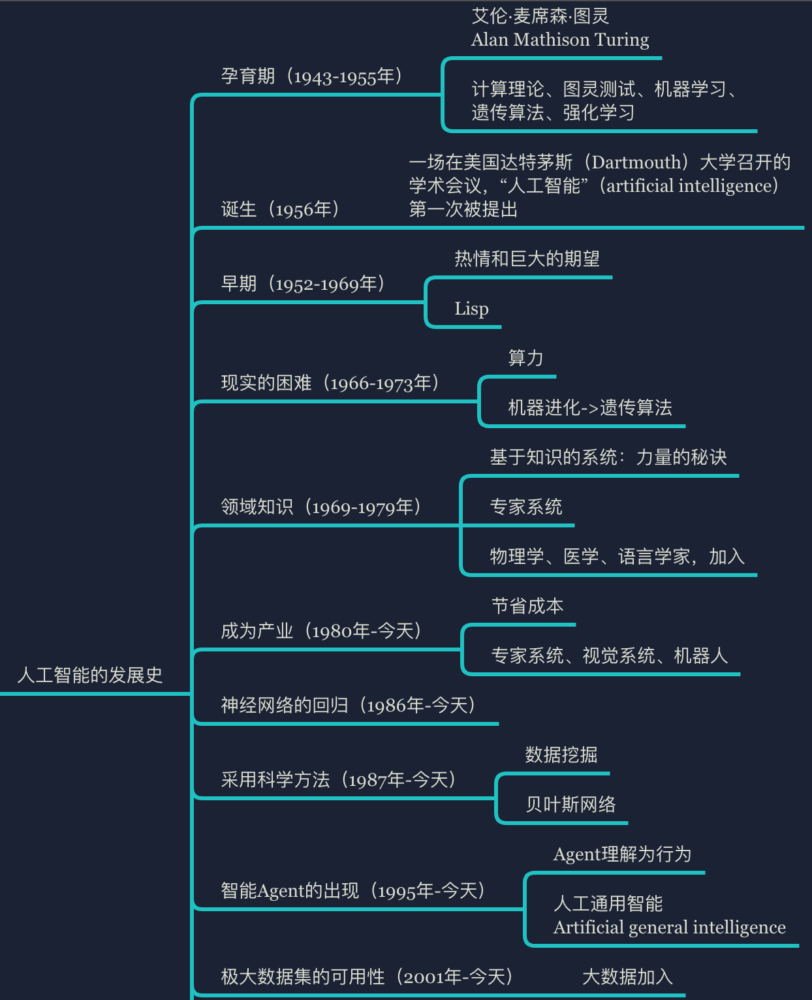
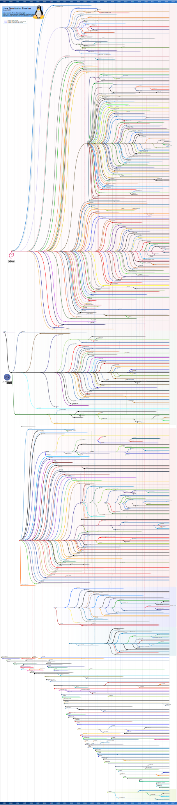

# Day0

# 1. 小调查


# 2. 人工智能介绍

## 2.1 什么是人工智能

### 2.1.1 书籍推荐

《人工智能：一种现代的方法》



### 2.1.2 书中的定义



### 2.1.3 百科定义

[百度上的定义](https://baike.baidu.com/item/%E4%BA%BA%E5%B7%A5%E6%99%BA%E8%83%BD/9180)

### 2.1.4 我的定义：综合学科

### 2.1.5 基础

1. 哲学
2. 数学
3. 经济学
4. 神经科学
5. 心理学
6. 计算机工程
7. 控制论
8. 语言学

### 2.1.6 外延

#### 电影

    百度搜索：人工智能 电影

#### 网上的一个榜单

[36部值得一看的人工智能电影](https://www.sohu.com/a/237690378_464000)

#### 推荐

[模仿游戏](https://movie.douban.com/subject/10463953/)

[人工智能](https://movie.douban.com/subject/1302827/)

[机械姬](https://movie.douban.com/subject/4160540/)

[我，机器人](https://movie.douban.com/subject/1308843/)

[超验骇客](https://movie.douban.com/subject/10810745/)

钢铁侠--系列

[星球大战](https://baike.baidu.com/item/%E6%98%9F%E7%90%83%E5%A4%A7%E6%88%98/33861)

变形金刚--系列

> 电影是虚构的，那些电影角色也是虚构的，所以我们总是觉得人工智能缺乏真实感。但是，今天，我们还会感觉不真实么？

#### 图灵测试

> 图灵测试（The Turing Test）由艾伦·麦席森·图灵发明，指测试者与被测试者（一个人和一台机器）隔开的情况下，通过一些装置（如键盘）向被测试者随意提问。进行多次测试后，如果有超过30%的测试者不能确定出被测试者是人还是机器，那么这台计算机就通过了测试，并被认为有人类的智能。

#### 人工智能的不同层次

- 弱人工智能：弱人工智能是擅长于单个方面的人工智能。比如有能战胜象棋世界冠军的人工智能，但是它只会下象棋，你要问他怎么样更好地在硬盘上储存数据，他就不知道怎么回答你了。

- 强人工智能（通用人工智能）：人类级别的人工智能。强人工智能是指在各方面都能和人类比肩的人工智能，人类能干的脑力活它都能干。创造强人工智能比创造弱人工智能难得多，我们现在还做不到。Linda Gottfrefson教授把智能定义为“一种宽泛的心理能力，能够进行思考、计划、解决问题、抽象思维、理解复杂概念、快速学习和从经验中学习等操作。”强人工智能在进行这些操作时应该和人类一样得心应手。

- 超人工智能：牛津哲学家，知名人工智能思想家Nick Bostrom把超级智能定义为“在几乎所有领域都比最聪明的人类大脑都聪明很多，包括科学创新、通识和社交技能。”超人工智能可以使各个方面都比人类强一点，也可以是各个方面都比人类强万亿倍的。超人工智能也正是为什么人工智能这个话题这么火热的缘故，同样也是为什么永生和灭绝这两个词会在本文中多次出现。

#### 发展史



#### 今天

| 应用          | 应用                                                         |
| ------------- | ------------------------------------------------------------ |
| 自动驾驶      | Waymo、Velodyne、Bosch、Tesla                                |
| 文字/语音识别 | 科大讯飞、Google                                             |
| 博弈          | DeepBlue（深蓝）、AlphaGo                                    |
| 机器人        | [波士顿狗](https://www.bostondynamics.com/)  [B站视频](https://www.bilibili.com/video/BV1v64y1T71q) |
| 视觉识别      | 支付宝人脸支付、无人超市                                     |
| 助理          | Siri、hey,google、小爱同学                                   |
|               | [Google IO 2018](https://www.bilibili.com/video/BV1kW411N74i) 35:02 [Google IO 2019](https://www.bilibili.com/video/BV1r4411v7y9) 22:33 |

## 2.2 我们要怎么学

### 2.2.1 研究方向

#### 理念：需要大量的跨各类学科的数学知识

#### 获取知识渠道：MOOC

> https://www.edx.org/  对旁听者完全免费，认证收费

> https://www.coursera.org/  认证收费

#### 课程

| 课程名 | 地址     |
| :------------- | :------------- |
| MIT 的微积分课程       | [微分](https://www.edx.org/course/calculus-1a-differentiation) [积分](https://www.edx.org/course/calculus-1b-integration)      |
| 线性代数       | [线性代数](https://www.edx.org/course/linear-algebra-foundations-to-frontiers)       |
| 概率与统计       | [概率与统计](https://www.edx.org/course/probability-the-science-of-uncertainty-and-data)       |
| 其他学习资料       | [这是一个](http://neuralnetworksanddeeplearning.com/) [这是另一个](http://www.deeplearningbook.org/)      |

### 2.2.2 应用方向

#### 理念

1. 应用更多是关于使用现有工具去获取有用的结果
2. 不要想着去构建新工具
3. 对一些底层的数学，尤其是统计学的了解仍然是非常有用的，甚至可以说是必需的
4. 在这里编程是核心技能

#### 课程

1. [Python](https://www.python.org/)
2. [R语言](https://www.r-project.org/about.html)

#### 工具

1. [TensorFlow](https://www.tensorflow.org/)
  1. [教程](https://www.tensorflow.org/tutorials/)
2. [数据源](https://www.kaggle.com/)

#### 涉及领域

不仅是与数学、编程、数据有关的一个宽泛主题。作为一个综合体涉及到了许多其它的领域：**哲学**、**数学**、**经济学**、**神经科学**、**心理学**、**计算机工程**、**控制论**、**语言学**、**博弈论**、**运筹学** 等等。

#### 补充

1. 不应该将工具视为神秘地输出答案的黑匣子
2. 应该去了解不同技术、模型、和数据采集方法的限制和潜在偏差
3. 不需要：深入研究他们工具链中每个部分的理论基础
4. 需要：理解人工智能的大量的背景知识还是很有用的

## 2.3 作为一名程序员，先要写出优雅的代码

# 3. 学习人工智能的基础

## 3.1 必须掌握

1. 数学
2. 英语：能看懂文档，能写代码中用到的单词
3. 操作系统：Linux（Ubuntu）或 MacOS
4. Python

## 3.2 辅助

1. Markdown语法
2. Git（生产力工具）
3. 编辑器：IDE（PyCharm）选学：Vim

# 4. Linux系统介绍

## 4.1 为什么Linux

1. 开源
2. 高效
3. 适合开发者（除微软系）
4. 百度搜索：为什么优秀的程序员用Linux

PS：优秀的程序员用Google

## 4.2 为什么Ubuntu

### 4.2.1 三大发行版

| 基于     | 发行版     |
| :------------- | :------------- |
| debian       | Debian、Ubuntu、Knoppix -> Kali       |
| slackware       | Suse、Opensuse       |
| redhat       | Red Hat Enterprise、CentOS、Fedora       |
| 流行       | Arch、Android       |



### 4.2.2 更新、维护：稳定2年一个TLS版本

### 4.2.3 省心：驱动、安装方便、友好Desktop

## 4.3 直接安装--推荐

优先推荐！

2台以上电脑，可以找一台配置低一点的，安装Ubuntu

1台电脑，可以搜索Windows Ubuntu双系统

## 4.4 Windows

https://www.virtualbox.org/

Win10：虚拟机 或 Hyper-V

Win10以下版本：虚拟机

## 4.5 MacOS

直接使用 或 虚拟机

# 5. 教学工具

## 5.1 Github

https://github.com/

注册账号

教学及作业提交：

https://github.com/TRLAI/ai2020

## 5.2 Slack

https://slack.com/downloads

下载、安装，查看邀请邮件，点击链接，输入邮箱

## 5.3 Git

https://git-scm.com/

### 5.3.1 基本命令

- git config // 配置命令

```
// 配置全局用户名
git config --global user.name "ZhangSan"
// 配置全局邮箱
git config --global user.email "1@1.com"
// Mac有可能会需要配置
git config --global core.editor vim
```

- git clone  // 克隆仓库

```
// 克隆教学仓库
git clone https://github.com/TRLAI/ai2020.git
```

- git status // 查看仓库状态

- git branch // 分支查看

```
// 查看本地分支
git branch
// 查看本地和远程分支
git branch -a
```

- git checkout // 切换分支，等等

```
// 切换并创建本地的**test**分支
git checkout -b test
// 切换到主分支
git checkout master
```

- git add // 向仓库中添加未被跟踪的文件或文件夹

```
// 添加单个文件**README.md**
git add README.md
// 添加文件夹**test**
git add test/
```

- git commit // 提交

```
// 提交，直接添加提交的信息
git commit -m "提交信息"
// 提交，用编辑器添加提交信息，需要提前设置好编辑器
git commit
```

- git push // 推送提交到远程仓库

```
// 推送提交信息到远程仓库的**master**分支
git push origin master
```

- git pull //从远程仓库下拉代码

```
// 下拉远程**master**分支，并合并到本地当前分支
git pull origin master
```

- git init // 在项目目录下，创建一个空的本地仓库

### 5.3.2 使用Git的简单工作流

1. clone仓库
2. 创建自己的分支，名字为自己名字的拼音
3. 创建项目目录，添加、修改项目文件（**经常**）
4. 提交并添加提交信息（**频繁**）
5. 推送提交信息到远程仓库，自己的分支（**经常**）
  1. 如果在多台机器进行操作，每次都需要先下拉（更新）自己分支的代码（**根据需要**）

## 5.4 Anaconda

环境及基础扩展的集成环境

https://www.anaconda.com/products/individual

```
运行 Anaconda Powershell Prompt (anaconda3)

切换到工作目录

jupyter-notebook.exe
```

# 6. 程序员的“品质”

1. “懒”--总想要找到更好的实现方式
2. 原理
3. 方法论
4. 敲代码--肌肉记忆

# 作业

1. 工具的注册、安装(GitHub\Slack)
2. Git基础使用
3. 安装Anaconda的集成环境
4. 快速体验--Jupyter Notebook

# 选学：Ubuntu配置

1. 配置中文显示
2. 配置中文输入法
3. 安装工具

google chrome

https://www.google.cn/chrome/

git

```
sudo apt install git
```

vim

```
sudo apt install vim
```

pip

```
sudo apt install python3-pip
```

更换pip源

```
mkdir ~/.pip
vim ~/.pip/pip.conf

[global]
timeout = 6000
index-url = https://mirrors.aliyun.com/pypi/simple/
trusted-host = mirrors.aliyun.com

国内源列表:

阿里云 https://mirrors.aliyun.com/pypi/simple/
豆瓣 https://pypi.douban.com/simple
清华大学 https://pypi.tuna.tsinghua.edu.cn/simple/
Python官方 https://pypi.python.org/simple/
```

pip安装jupyter

```
pip3 install --upgrade pip

pip3 install jupyter notebook
```

运行notebook

```
jupyter notebook
```
